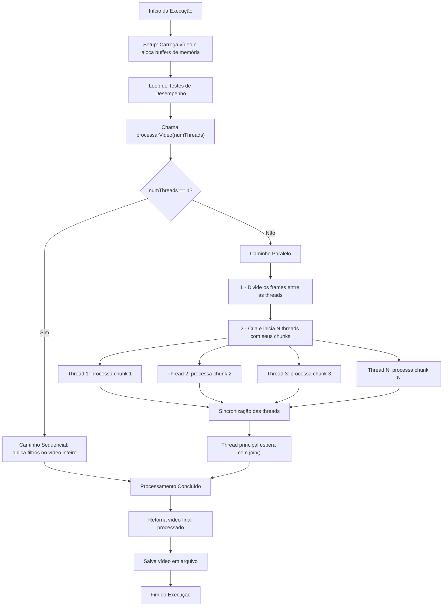

# **Processamento Paralelo de Vídeo em Java**

## **Visão Geral do Projeto**

Este projeto foi desenvolvido para a disciplina de Arquitetura e Organização de Computadores e tem como objetivo a restauração de um vídeo antigo em fita VHS, que registra um momento familiar importante para o Sr. José, um morador de Ouro Branco. O vídeo está degradado por dois tipos de defeitos visuais: um ruído do tipo "Salt and Pepper", que se assemelha a chuviscos, e borrões ou flashes de sinal que comprometem a clareza de quadros específicos.

A solução implementada ataca o problema em duas frentes:

1.  **Correção Visual:** Aplicação de algoritmos de processamento de imagem para remover os ruídos e anomalias do vídeo.
2.  **Otimização de Desempenho:** Utilização de uma arquitetura de processamento paralelo para explorar múltiplos núcleos de CPU e acelerar o tempo de correção.

## **Documentação Detalhada**

Para uma análise completa do projeto, incluindo o detalhamento da implementação, a explicação aprofundada dos algoritmos, a estrutura de dados e a análise crítica completa dos resultados de desempenho, acesse o documento PDF na raiz deste repositório:

  * **[doc.pdf](https://github.com/liceki/VideoProcessing/blob/main/doc.pdf)**

## **Tecnologias Utilizadas**

  * **Java 17:** Linguagem principal do projeto.
  * **Maven:** Para gerenciamento de dependências e build do projeto.
  * **OpenCV (via `nu.pattern.OpenCV`):** Biblioteca utilizada para as operações de baixo nível de decodificação e codificação dos frames do vídeo.

## **Estrutura do Projeto**

A arquitetura do software foi organizada para garantir clareza e manutenção, com as seguintes classes principais:

  * **`VideoProcessing`:** Classe principal que contém o método `main`, responsável por orquestrar todo o fluxo de execução, incluindo os testes de desempenho.
  * **`VideoDTO`:** Um *Data Transfer Object* que encapsula todos os dados e parâmetros da execução, simplificando a comunicação entre métodos e threads.
  * **`Thread`:** Classe customizada que herda de `java.lang.Thread` e representa a unidade de trabalho ("worker") no processamento paralelo.
  * **`VideoProcessingMethods`:** Classe que centraliza a lógica dos algoritmos de aplicação dos filtros de imagem.

## **Fluxograma da Execução**

O diagrama abaixo ilustra o fluxo de execução do programa, desde o início no `main` até a decisão entre o processamento sequencial ou paralelo e a sincronização final.



## **Como Executar o Projeto**

### **Pré-requisitos**

  * JDK 17 ou superior.
  * Apache Maven 3.6 ou superior.

### **Passos para Execução**

1.  Clone este repositório:
    ```bash
    git clone https://github.com/liceki/VideoProcessing
    ```
2.  Navegue até o diretório do projeto:
    ```bash
    cd VideoProcessing
    ```
3.  Compile o projeto e baixe as dependências com o Maven:
    ```bash
    mvn clean install
    ```
4.  Execute a classe principal `br.com.ifmg.gp.VideoProcessing` através da sua IDE ou via linha de comando.

## **Resultados dos Testes de Desempenho**

Os testes foram realizados em uma máquina com as seguintes especificações:

  * **Processador:** Intel Core i5-10400F (6 núcleos / 12 threads, até 4.3 GHz)
  * **Memória RAM:** 16 GB DDR4 2666 MHz
  * **Armazenamento:** SSD Lexar NVMe 3.0 de 512 GB

A tabela abaixo apresenta os tempos de execução registrados.

| Configuração | Tempo - Média (ms) | Tempo - Mediana (ms) |
| :--- | :--- | :--- |
| **Sequencial** | 62454 | 122976 |
| **2 Cores** | 31740 | 64245 |
| **4 Cores** | 17466 | 34020 |
| **8 Cores** | 12087 | 23455 |
| **16 Cores**| 11661 | 20606 |
| **32 Cores**| 11854 | 21076 |


## **Autores**

  * [Antonio Carlos Jr.](https://github.com/antonio-carlosjr)
  * [Henrique Leão](https://github.com/liceki)
  * [Rhuan Azevedo](https://github.com/RhuanAzevedo)
